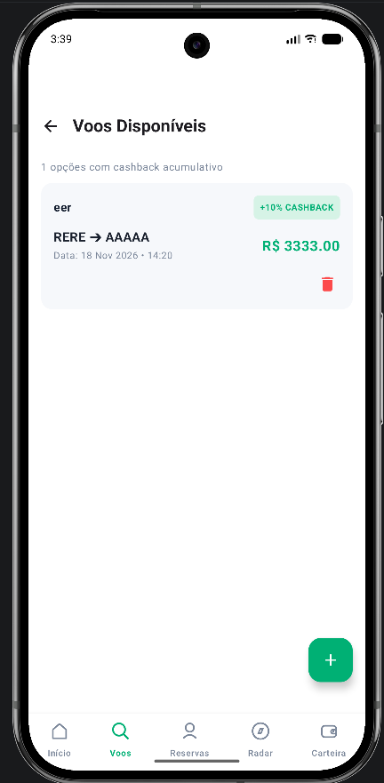
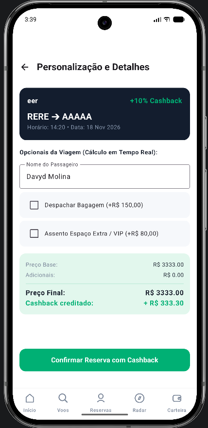
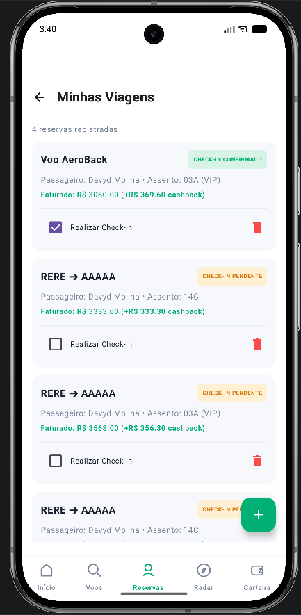
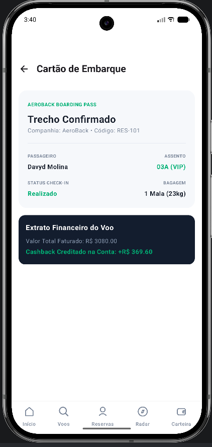

# AeroBack - Minimo Aplicativo Funcional (MAF)

Aplicativo Android nativo desenvolvido em Jetpack Compose voltado para busca, emissao e gestao de passagens aereas com programa integrado de cashback acumulativo.

## Integrantes da Dupla

- Integrante 1: Davyd Eduardo Ferreira - RA / Matricula: 42284805
- Integrante 2: Guilherme Brunetti - RA / Matricula: 042261015

## Tecnologias e Dependencias

- Linguagem: Kotlin 1.9+
- Toolkit UI: Jetpack Compose (BOM 2024.x)
- Design System: Material Design 3 (androidx.compose.material3:material3)
- Navegacao: Navigation Compose (androidx.navigation:navigation-compose:2.7.7)
- Iconografia: Material Icons Extended (androidx.compose.material:material-icons-extended)
- Arquitetura de Estado: SnapshotStateList (mutableStateListOf) no nivel raiz da aplicacao
- Compilacao: compileSdk 34, minSdk 24, targetSdk 34

## Como Rodar o Projeto

### Pre-requisitos
- Android Studio (versao Hedgehog 2023.1.1 ou superior).
- JDK 17 configurado no ambiente de execucao do Gradle.
- Emulador Android (API 30 ou superior) ou dispositivo fisico com depuracao USB ativada (minSdk 24).

### Passo a Passo
1. Clone o repositorio:
   git clone https://github.com/davyd9/Aero-Back-segunda-entrega.git
2. Abra o Android Studio e selecione "File > Open", apontando para a pasta raiz clonada.
3. Aguarde o download das dependencias e sincronizacao do Gradle ("Sync Project with Gradle Files").
4. Selecione a configuracao de execucao "app" e o dispositivo de destino.
5. Pressione "Run 'app'" (Shift + F10) ou clique no botao de execucao verde.

---

## Documentacao e Decisoes do Projeto

### 1. Evolucao do Trabalho 1 para o Trabalho 2
No Trabalho 1, o AeroBack era composto por tres telas de layout estatico: Busca (SearchScreen), Radar de Precos (PriceRadarScreen) e Carteira (WalletScreen). Nao existia navegacao de pilha real nem transmissao de dados entre telas; a barra inferior apenas alternava uma variavel de estado local com estrutura condicional simples.

No Trabalho 2 (Minimo Aplicativo Funcional), o projeto recebeu as seguintes implementacoes estruturais:
- Arquitetura centralizada de navegacao baseada em NavHost e NavController em MainActivity.kt.
- Declaracao de rotas e rotas parametrizadas em um objeto singleton Rotas (RotasNavegacao.kt).
- Criacao de colecoes reativas globais com mutableStateListOf para as entidades Voo e Reserva, viabilizando persistencia em memoria e sincronizacao entre todas as telas.
- Expansao para 7 telas reais, integrando fluxos de adicao, remocao, filtros, calculos tarifarios e geracao de bilhete de embarque.

### 2. Relacao das Telas do Aplicativo
O aplicativo possui 7 telas navegaveis distribuidas no dominio de viagens:

1. Busca de Voos (SearchScreen / TelaBuscaVoos.kt): Ponto de entrada do usuario. Exibe informacoes do cashback acumulado, permite selecionar o tipo de viagem, alternar origem e destino, definir datas, configurar passageiros e acessar rotas em destaque.
2. Radar de Precos (PriceRadarScreen / TelaRadarPrecos.kt): Apresenta historico de oscilacao de precos e alertas tarifarios, auxiliando o passageiro a identificar a melhor janela de compra.
3. Carteira Digital (WalletScreen / TelaCarteiraCashback.kt): Painel financeiro com saldo disponivel, saldo pendente liberado apos voos e historico de transacoes de cashback, com funcionalidade de solicitacao de resgate via Pix.
4. Catalogo de Voos (FlightListScreen / TelaListaVoos.kt): Primeira tela de listagem dinamica baseada em LazyColumn. Exibe voos cadastrados com preco e porcentagem de cashback. Inclui formulario em dialogo para cadastrar novos voos e botao individual para remocao de rotas.
5. Detalhes e Customizacao do Voo (FlightDetailsScreen / TelaDetalhesVoo.kt): Tela detalhada do voo selecionado via argumento de rota. Possui calculadora em tempo real para adicionais de bagagem e assento, atualizando o preco total e o cashback a ser recebido, com emissao direta de reserva.
6. Minhas Viagens (BookingListScreen / TelaListaReservas.kt): Segunda tela de listagem dinamica baseada em LazyColumn. Gerencia as reservas ativas, permitindo emissao manual de bilhete, cancelamento com remocao da lista e realizacao de check-in com mudanca reativa de estado.
7. Cartao de Embarque (BookingDetailsScreen / TelaCartaoEmbarque.kt): Exibe o bilhete eletronico consolidado, cruzando os dados da reserva do passageiro com as informacoes do voo correspondente e apresentando codigo de verificacao visual para embarque.

### 3. Decisoes de Organizacao e Arquitetura
- Centralizacao das Rotas (RotasNavegacao.kt): O objeto Rotas agrupa constantes de texto (const val) para cada tela e funcoes auxiliares para rotas que exigem argumentos (flightDetail e bookingDetail). Isso elimina erros em tempo de execucao decorrentes de strings digitadas incorretamente.
- Estado Reativo no Escopo da Aplicacao (MainActivity.kt): As listas de voos e reservas foram declaradas no composable raiz AeroBackApp utilizando mutableStateListOf. Essa decisao assegura que operacoes de adicao, remocao ou edicao persistam na memoria durante toda a sessao de uso, mesmo durante transicoes entre rotas.
- Barra Inferior com Preservacao de Pilha: O componente CustomBottomNavigation implementa as diretrizes do Jetpack Compose para barras de navegacao, aplicando popUpTo com saveState = true, launchSingleTop = true e restoreState = true.
- Retorno de Navegacao com popBackStack(): As telas de listagem e detalhes incorporam TopAppBar com acao de retorno pelo NavController, garantindo que o usuario consiga voltar a tela anterior sem reiniciar o estado do grafo.

### 4. Complexidade Extra na Tela de Detalhes
A complexidade extra exigida no Trabalho 2 foi distribuida em duas frentes complementares:
1. Calculo Tarifario Dinamico em Tempo Real (TelaDetalhesVoo.kt): O usuario pode marcar adicionais opcionais (Bagagem Despachada por R$ 150,00 e Assento VIP por R$ 80,00). O valor total e o retorno exato de cashback em Reais sao recalculados instantaneamente a cada clique. Ao confirmar, os valores finais calculados sao gravados diretamente em uma nova instancia da entidade Reserva.
2. Composicao Relacional de Entidades (TelaCartaoEmbarque.kt): A tela recupera o identificador bookingId, localiza a respectiva Reserva e faz a busca do Voo associado por meio do vooId. Ela une os dados das duas entidades para construir o Cartao de Embarque completo, exibindo assento, passageiro, adicionais, itinerario, horario e o status do check-in.

### 5. Desafios Tecnicos e Solucoes Adotadas
- Recomposicao de Itens em LazyColumn: A alteracao de propriedades em um item existente de Reserva nao disparava a recomposicao automatica da lista. A solucao foi recriar a instancia utilizando o metodo copy() da data class e reatribuir o objeto na posicao correspondente da SnapshotStateList (reservas[index] = reserva.copy(...)).
- Seguranca de Tipos e Argumentos Nulos: Para evitar falhas de execucao ao abrir telas de detalhes com identificadores inexistentes, o NavHost foi configurado com navArgument do tipo StringType associado a verificacoes defensivas via firstOrNull.
- Validacao de Dados nos Formularios: A conversao de valores numericos inseridos nos dialogos de cadastro foi protegida com toDoubleOrNull() e toIntOrNull() aliados ao operador Elvis (?:), prevenindo falhas do tipo NumberFormatException.

---

## Capturas de Tela do Aplicativo

### 1. Catalogo de Voos Disponiveis (TelaListaVoos)
Demonstracao da listagem reativa via LazyColumn com taxa de cashback e acao de exclusao de trechos.

### 2. Detalhes e Recalculo Tarifario em Tempo Real (TelaDetalhesVoo)
Demonstracao do diferencial tecnico: calculo dinamico de opcionais (bagagem e assento VIP) e projecao monetaria de cashback.

### 3. Gestao de Reservas e Check-in Reativo (TelaListaReservas)
Demonstracao da segunda lista reativa: status do bilhete, confirmacao de check-in e remocao via icone de exclusao.

### 4. Cartao de Embarque Consolidado (TelaCartaoEmbarque)
Demonstracao da integracao relacional: cruzamento dos dados da reserva com o voo original gerando o bilhete final.

Link da Apresentação Com Videos no Canva: https://canva.link/b155s2fcb1umoiu
